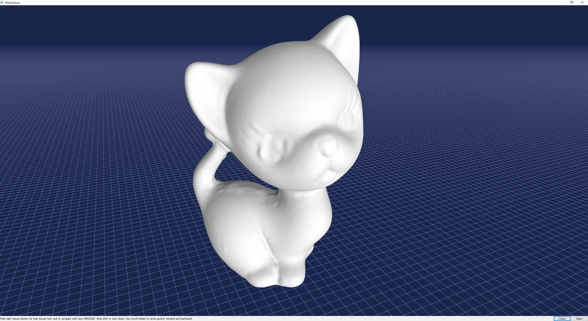
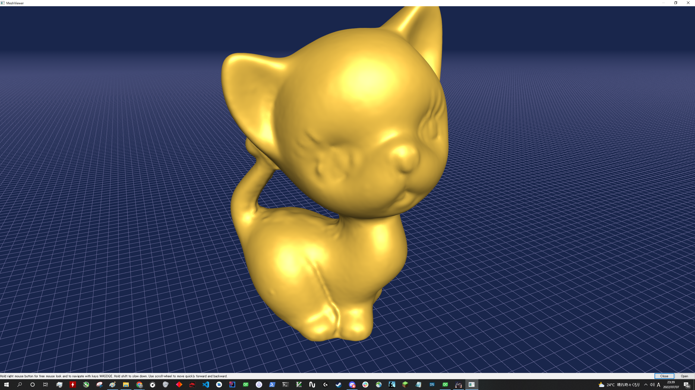

# mesh-viewer
三角形メッシュを読み込んで表示するアプリです．

### バグ
- 面を選択するとアプリが落ちる

### 現在の機能
- メッシュの読み込み
- フラグメントシェーダの読み込み
- フラグメントシェーダの変更
- 視点移動
- 選択した面の強調表示

### 対応形式
- メッシュ
  - obj
  - off
- シェーダ
  - frag 

QtCreatorを利用して開発しています．現在は，QtCreatorを利用しての実行に対応しています．  
development branch に開発中のものを上げています。

  
   
  <em>Lambert reflection</em>
   
  
   
  <em>Phong shading</em>

利用ライブラリ：Qt  
参考文献　　　：[OpenGL + Qt Tutorial](https://github.com/ghorwin/OpenGLWithQt-Tutorial)

注意：ファイルパスに日本語が含まれているとちゃんと表示できません．

　　：現在も開発中

