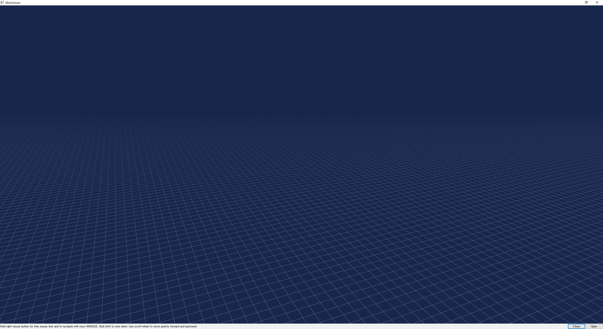
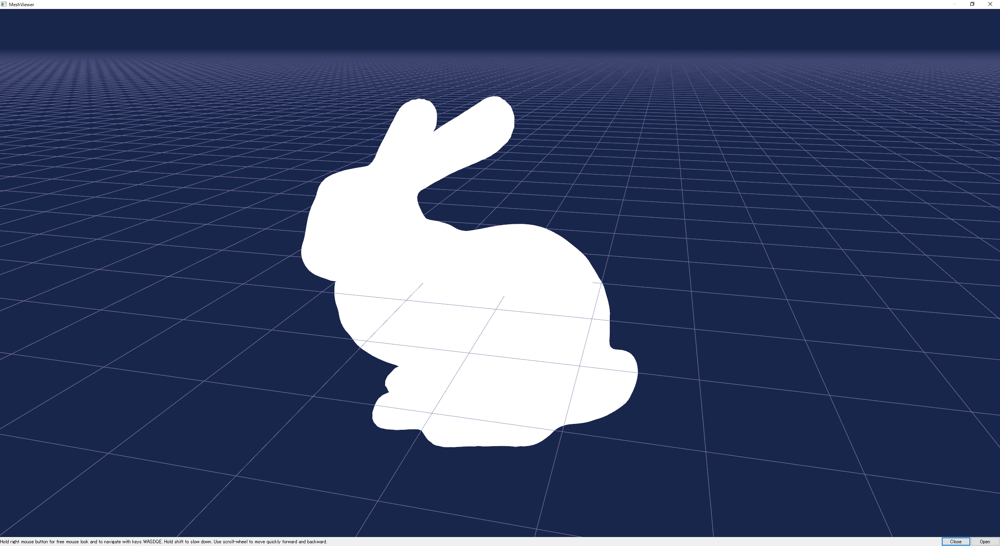
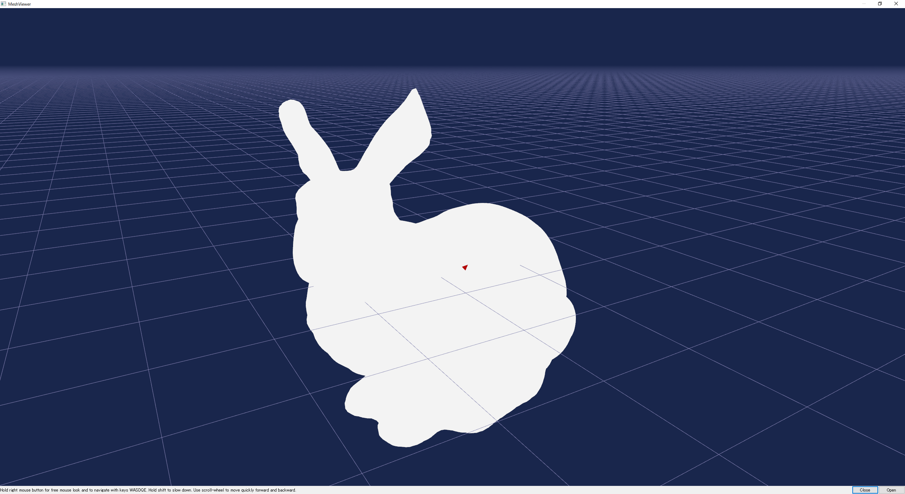

# mesh-viewer
三角形メッシュを読み込んで表示するアプリです．

現在の機能：メッシュの読み込み，視点移動，選択した面の強調表示

対応形式：obj，off

  
   
  <em>mesh viewerを立ち上げたときの画面</em>
  
  
   
  <em>面を選択すると赤く強調されます．（上が選択前，下が選択後）</em>

利用ライブラリ：Qt

注意：ファイルパスに日本語が含まれているとちゃんと表示できません．
  
　　：現在も開発中

